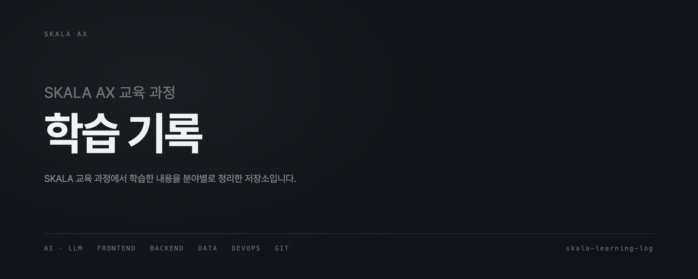

# SKALA AX 학습 기록

SKALA 교육 과정에서 학습한 프론트엔드, 백엔드, 데이터, AI·LLM 내용을
직접 실습하고 이해한 기준으로 정리한 저장소입니다.

## 저장소 구조

```
lecture/    수업에서 배운 내용을 분야별로 정리
projects/   수업 밖에서 직접 만든 프로젝트 기록
```

## 수업 (lecture)

### AI·LLM

*(아직 없음)*

### 프론트엔드

- [JavaScript 모듈: 파일을 나눠도 스코프는 나뉘지 않는다](lecture/frontend/javascript-modules.md)
- [JavaScript 비동기 실행 모델: 데이터가 먼저 도착해도 끼어들 수 없다](lecture/frontend/javascript-async-model.md)
- [브라우저가 제공하는 API: fetch는 404에 실패하지 않는다](lecture/frontend/browser-apis.md)
- [computed와 watch: 값을 만들 것인가, 일을 시킬 것인가](lecture/frontend/computed-and-watch.md)

### 백엔드

*(아직 없음)*

### 데이터·통계

*(아직 없음)*

### 데이터베이스

- [실행계획 읽기: 실행시간만 보면 반대로 판단한다](lecture/database/explain-analyze.md)
- [인덱스 설계: 만들었는데 안 쓰이는 게 정상일 때가 있다](lecture/database/index-design.md)
- [JOIN 알고리즘: INNER/LEFT는 의미고, Hash/Nested Loop는 실행이다](lecture/database/join-algorithms.md)
- [윈도우 함수: 상관 서브쿼리를 바꿨더니 버퍼가 140분의 1이 됐다](lecture/database/window-functions.md)
- [SQL의 NULL: 에러가 안 나는 게 문제다](lecture/database/null-in-sql.md)

### Python

*(아직 없음)*

### GitHub·협업

- [Git 기본 흐름: Staging Area는 저장이 아니다](lecture/github-collaboration/git-basics.md)
- [Git 브랜치 전략: fast-forward는 흔적을 남기지 않는다](lecture/github-collaboration/git-branch-strategy.md)
- [Git 되돌리기: restore, reset, revert, stash](lecture/github-collaboration/git-recovery.md)
- [.gitignore와 비밀정보 관리](lecture/github-collaboration/gitignore-and-secrets.md)

### DevOps

- [macOS 개발 환경: source가 왜 필요한가](lecture/devops/macos-dev-environment.md)
- [Vite 환경변수와 빌드 모드: .env는 값을 숨기지 않는다](lecture/devops/vite-env-and-build-modes.md)
- [GitHub Pages에 SPA 배포하기: 화면이 정상이어도 404가 온다](lecture/devops/spa-on-github-pages.md)

## 프로젝트 (projects)

*(아직 없음)*

## 정리 원칙

- 강의 내용을 그대로 옮기지 않습니다.
- 직접 이해하고 검증한 내용만 작성합니다.
- 코드가 어떻게 동작하는지 설명합니다.
- 오류와 해결 과정도 함께 기록합니다.
- 배운 개념이 프로젝트에 어떻게 적용됐는지 연결합니다.

## 문서 구조

각 문서는 다음 순서를 따릅니다.

1. 개념 정의
2. 동작 원리
3. 직접 확인한 예시
4. 자주 발생하는 오류
5. 프로젝트 적용 사례
6. 배운 점
